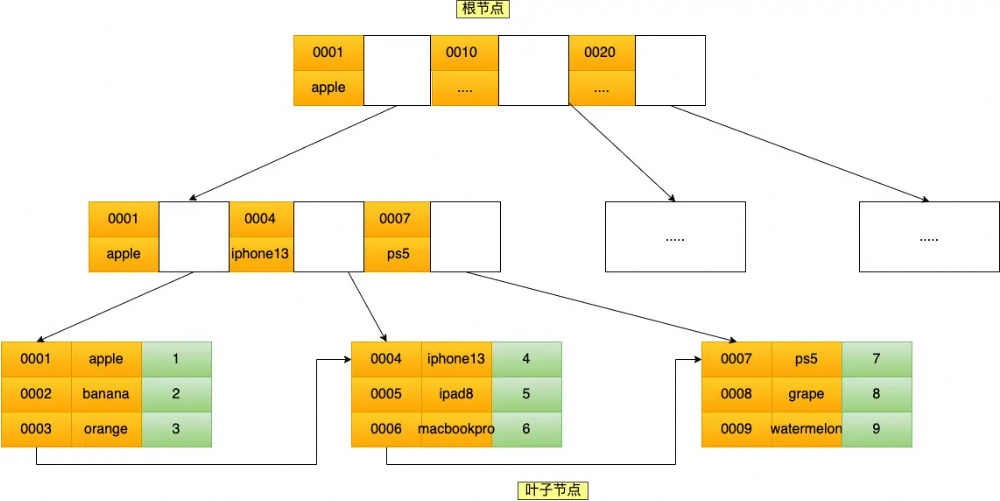

## 什么是索引？作用是什么？

数据的目录，作用是快速定位到数据的位置

- 不使用索引，全表扫描数据，时间复杂度O(n)
- 使用索引，B+树通过二分查找查询数据，时间复杂度O(logdn)，d为树高


## 索引的分类？

看按什么维度分类，按物理存储分类，分为聚簇索引和非聚簇索引

- 按数据结构，B+树索引，hash索引，full-text索引
- 按物理存储，聚簇索引（主键索引），非聚簇索引（二级索引）
- 按字段特性，主键索引，唯一索引，普通索引，前缀索引
- 按字段个数，单列索引，联合索引


## innodb聚簇索引选择规则？

如果有主键，主键是聚簇索引

- 如果有主键，主键是聚簇索引
- 如果没有主键，选择第一个没有NULL值的唯一列
- 如果都没有，生成一个隐藏自增id列


## 聚簇索引和非聚簇索引的区别？

聚簇索引叶子节点存放完整行数据，非聚簇索引叶子节点存放主键值，非聚簇索引需要回表才能找到完整行数据

- 叶子节点，聚簇索引叶子节点，存放索引值 + 行数据；非聚簇索引叶子节点，存放索引值 + 主键值。每个节点按索引值顺序存放
- 非叶子节点，聚簇索引非叶子节点，存放索引值 + 子节点指针；非聚簇索引非叶子节点，存放索引值 + 子节点指针。每个节点按索引值顺序存放
- 查找方式，聚簇索引可以直接找到行数据；非聚簇索引需要回表才能找到行数据


## 什么是回表？

非聚簇索引叶子节点不存放完整行数据，只存放主键值，想要获取完整行数据，需要再查询一遍聚簇索引，这个过程叫回表

- 非聚簇索引，非叶子节点存放索引值 + 子节点指针，叶子节点存放索引值 + 主键值，想要获取完整行数据，需要再查询一遍聚簇索引
- 聚簇索引，叶子节点存放索引值 + 完整行数据


## 什么是索引覆盖？

使用非聚簇索引进行查询时，如果索引值覆盖了需要查询的字段，只需通过索引就能获得查询结果，无需回表获取完整数据行，减少IO操作次数


## 什么是索引下推（ICP）？

索引下推是一种查询优化技术，如果查询条件包含了索引列，MYSQL会将查询条件从服务器层下推到存储引擎层，提前进行数据的过滤，从而减少回表次数和传递过程的数据量

```mysql
SELECT * FROM tbl_user WHERE age > 30 AND city = 'Beijing';
```

- 无ICP，找到所有满足age>30的索引记录 → 对每条记录回表，获得完整行数据  → 执行器过滤满足city = Beijing的行数据
- 有ICP，找到所有满足age>30，city = Beijing的索引记录 → 对每条记录回表，获得完整行数据


## 更新聚簇索引数据，存储会不会有变化？

更新非索引数据，存储结构不会变化；更新索引数据，存储结构会变化，因为B+树会维护数据的有序性


## MYSQL主键是聚簇索引吗？

是的，如果有主键，主键是聚簇索引


## 什么字段适合当主键？

自增id适合当主键，字段值唯一，没有NULL值，而且是递增的

- 字段值唯一，不为NULL，递增
- 不建议用业务数据字段，以后业务字段可能有重复需求


## 主键用自增ID还是UUID？主键无序有什么问题？

自增id，主键值是递增的，新行总是插入到最后一个叶子节点，更容易命中缓存，也减少了页分裂和碎片的产生

- 命中缓存，递增的主键，新行总是插入到最后一个叶子节点，是顺序写，每次查询路径固定，命中缓存几率更大；无序的主键，需要为新行寻找合适位置插入，是随机写，每次查询路径不固定，命中缓存几率更小
- 页分裂，递增的主键，固定末尾页分裂，这种分裂是局部的，可控的；无序的主键，随机位置页分裂，大量页处于半满状态，产生更多数据碎片，影响性能


## 如何防止主键自增ID溢出？

设置为无符号BIGINT类型，最多支持存储2^64行数据，一般数据量达不到这个值

- 无符号BIGINT类型，8个字节，最多支持存储2^64行数据
- 无符号INT类型，4个字节，最多支持存储2^32行数据


## 哈希索引使用场景？

哈希索引适合等值查询，不适合范围查询和排序


## 性别字段能加索引吗？

不能，区分度过低，回表成本高，优化器会选择使用全表扫描


## MYSQL索引是怎么实现的？

索引使用B+树作为数据结构，非叶子节点存放索引值 + 子节点指针，叶子节点存放索引值 + 完整行数据，执行查询时，通过索引值进行二分查找，可以快速找到行数据

- 数据结构，B+树，非叶子节点存放索引值 + 子节点指针，叶子节点存放索引值 + 完整行数据，每个节点按索引值顺序存放，叶子节点用双向链表相互连接，这种结构树高矮IO少，适合范围查找和排序
- 执行过程，执行查询语句时，B+树根据索引值，自顶向下逐层查找，找到叶子节点后，读取数据页


## 执行查询时，到了B+树叶子节点，如何查找数据？

叶子节点是一个数据页，数据页有一个页目录，在页目录里根据索引值进行二分查找，可以快速定位到行数据所在的分组，然后遍历分组，就可以找到完整行数据


## B+树的特性？

所有叶子节点在同一层，非叶子节点存放索引值 + 子节点指针，叶子节点存放索引值 + 完整行数据，修改数据后会自平衡

- 所有叶子节点在同一层，每个节点按索引值顺序存放，用双向链表相互连接，适合范围查找和排序
- 非叶子节点存放键值，非叶子节点存放索引值 + 子节点指针，这种结构树高矮IO少
- 叶子节点存放行数据，叶子节点存放索引值 + 完整行数据
- 自平衡，数据修改后会自平衡，每个节点最多有M个子节点，M是树的阶数


## 为什么选择B+树？和其他结构相比的优点？

B+树和B树的区别主要有2点：

- 磁盘IO，B+树非叶子节点存放索引值 + 子节点指针，叶子节点存放索引值 + 完整行数据，而B树非叶子节点存放索引 + 数据。在数据量相同的情况下，B+树需要的树高更矮，磁盘IO操作更少
- 范围查找和排序，B+树叶子节点用双向链表相互连接，而B树没有用链表。B+树更适合范围查找和排序


B+树和二叉树的区别主要是磁盘IO少

- 磁盘IO，B+树树高O(logdn)，d为树高（一般大于100），而二叉树树高O(log2n)。在数据量相同的情况下，B+树需要的树高更矮，磁盘IO操作更少


B+树和hash表的主要区别是，hash表不适合范围查询和排序

- 范围查询和排序，B+树叶子节点用双向链表相互连接，而hash表没有用链表。B+树更适合范围查找和排序


## B+树的好处是什么？

B+树的好处主要有3点：

- 磁盘IO，B+树非叶子节点只存索引，不存行数据，在数据量相同的情况下，B+树需要的树高更矮，磁盘IO操作更少
- 范围查询和排序，B+树叶子节点用双向链表相互连接，范围查询和排序效率更高
- 节点插入删除，B+树有大量冗余节点（非叶子节点），树结构不会发生复杂的变化，节点插入删除效率更高


## B+树叶子节点链表是单向还是双向的？

双向的，支持正序/倒序遍历和排序


## 联合索引的实现原理？

联合索引是多个字段组成的索引，联合索引的索引值，按照从左到右的顺序排序（先按A字段排序，A相同再按B字段排序）




## 什么是联合索引的最左匹配原则？

使用联合索引查询时，会按从左到右的顺序匹配索引，如果不遵循最左匹配原则，索引会失效

- 使用索引的前提是索引有序，联合索引是按字段从左到右排序的（先按A字段排序，A相同再按B字段排序），如果跳过左边的字段进行查询，数据是无序的，就没有办法利用索引


## 创建联合索引时需要注意什么？

创建联合索引时，将区分度大的字段放在左边，更快地缩小查询范围

- 区分度，将区分度大的字段放在左边，更快的缩小查询范围，如果区分度过小，查出数据行大于阈值（通常30%），优化器会忽略索引，进行全表扫描


## 联合索引ABC，判断索引使用？

查询条件B>xx AND A=xx

- 根据最左匹配原则，A和B都能使用联合索引

查询条件A=xx AND C<xx

- 根据最左匹配原则，A能使用联合索引，C不能使用联合索引，但C可以触发索引下推，因为查询条件包含了索引列


## 如果一个列既是单列索引，又是联合索引，会使用哪个索引？

表包含abc列，单列索引a，联合索引(a, b)

```mysql
SELECT a, b FROM tbl_user WHERE a = 10
SELECT * FROM tbl_user WHERE a = 10
```

- 语句1，走联合索引，联合索引的叶子节点包含了SQL查询列，触发索引覆盖
- 语句2，走单列索引，和联合索引相比，扫描单列索引的成本更小


## 索引失效情况有哪些？

索引失效的情况主要有6种

- 查询结果占比过大，查询行数据大于全表数据的30%时，MYSQL认为回表成本更高，执行全表扫描

```mysql
SELECT * FROM tbl_user WHERE id > 10
```

- LIKE以通配符开头，MYSQL无法确定字符串的起始位置

```mysql
SELECT * FROM tbl_user WHERE description LIKE '%gary%'
```

- 对索引使用函数或计算，MYSQL无法直接使用索引值计算

```mysql
SELECT * FROM tbl_user WHERE DATE(create_time) = '2026-03-12'
SELECT * FROM tbl_user WHERE age + 1 = 30
```

- 隐式类型转换，隐式类型转换通过CAST函数实现，等同对索引使用函数

```mysql
-- phone字段类型为VARCHAR，查询条件为数字
SELECT * FROM user WHERE phone = 15001853110
```

- 联合索引违反最左匹配原则，按字段ABC排序，跳过A，后面字段是无序的

```mysql
SELECT * FROM tbl_user WHERE B = 10 AND C = 10
```

- OR列无索引，MYSQL认为索引合并代价更高，执行全表扫描

```mysql
-- age有索引，name无索引
SELECT * FROM tbl_user WHERE age = 30 OR name = 'gary'
```


## 插入一条数据，索引有什么变化？

MYSQL插入一条数据时，需要更新所有相关索引，插入一个新键值对到数据页中，以维护B+树的有序性，如果数据页满了，会触发页分裂操作


## 索引字段是不是越多越好？

不是，每次插入数据，需要更新所有相关索引，索引字段越多，维护索引消耗越大


## 索引的缺点？

主要有2点

- 占用物理空间，表的数据量越大，索引占用的空间越多
- 占用性能，每次插入删除修改索引数据，需要更新所有相关索引

