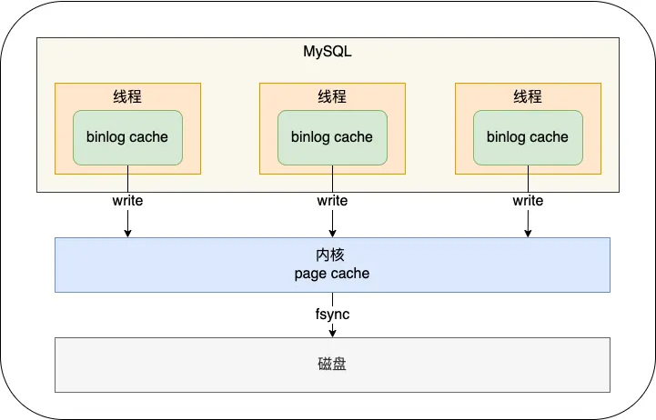
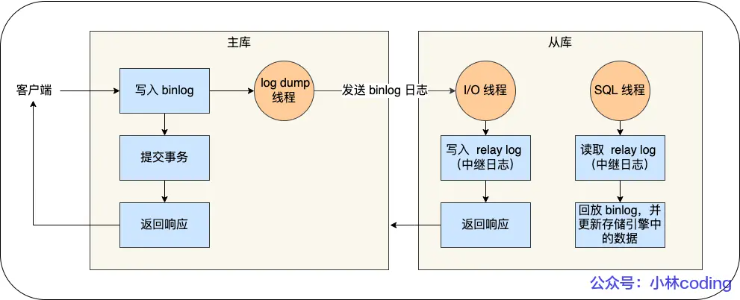

## 什么是undo log？

undo log是innodb的回滚日志，是逻辑日志，记录了修改命令和修改前的旧值，作用是实现事务回滚（Rollback）和多版本并发控制（MVCC） 

- 结构，包含了两个关键字段，事务ID，trx_id，回滚指针，roll_pointer
- 数据存储格式，更新记录时，写入UPDATE操作，和更新列的旧值 
- 作用1，事务回滚时，通过undo log，顺着版本链，找到数据的历史版本，回滚到事务开始前的状态，保证了事务的原子性
- 作用2，MVCC，通过undo log，顺着版本链，找到数据的历史版本，从而找到满足可见性的行数据
- 记录日志时机，数据修改前。为了保证事务原子性，先写日志，后改数据


## 什么是redo log？

redo log是innodb的前滚日志，是物理日志，记录了数据页的物理修改（比如，在xx数据页xx偏移量改为xx值），作用是数据库宕机时，恢复已提交但未落盘的数据

- 原理，修改记录时，MYSQL为了提升性能，不会立刻将数据写入磁盘，而是写入bufferPool和redo log，在合适的时间再写到磁盘上（WAL，write ahead logging），数据库宕机时，bufferPool脏页数据没持久化，但redolog已经持久化
- 作用1，恢复数据，数据库宕机重启后，通过redo log恢复最新数据，保证了事务的持久性
- 作用2，提升性能，合并多次IO操作，并将【随机写】优化为【顺序写】，提升数据库性能
- 刷盘时机，每次事务提交时（默认），或每隔1秒


## redo log是直接写入磁盘的吗？

不是，写入磁盘会有大量IO操作，redo log会先写入redo log buffer 

- redo log落盘时机，每次事务提交时（默认），或每隔1秒
- innodb_flush_log_at_trx_commit参数，默认为1。为0时，每次事务提交时，不将redo log落盘；为1时，每次事务提交时，将redo log落盘；为2时，每次事务提交时，不将redo log落盘，将redo log写入Page Cache。追求安全选1，追求性能选0或2


## redo log文件写满了怎么办？

MYSQL不能再执行更新操作，需要等redo log将记录擦除

- 轮转原理，redo log是以循环写的方式工作，写满文件0，写文件1，写满文件1，写文件0。redo log落盘后，对应的记录也没用了，所以redo log一边写还会一边擦除。当写入速度比擦除速度快时，redo log文件可能会被写满


## 什么是binlog？

binlog是server层的逻辑日志，记录了表结构和表数据的修改语句，作用是备份恢复和主从复制

- 日志内容1，STATEMENT，记录原始SQL语句，执行1条语句更新100行，记录1条日志，主从复制slave端重新执行该语句，存在动态函数的问题

```mysql
UPDATE user SET age = age + 1
```

- 日志内容2，ROW，记录每行数据的变更，执行1条更新100行，记录100条日志

```mysql
UPDATE user SET age = 21 WHERE id = 1
UPDATE user SET age = 22 WHERE id = 2
...
```

- binlog落盘时机，每次事务提交时（默认）。事务执行过程中，先把日志写到binlog cache（内存），事务提交时，再把binlog cache写入binlog（磁盘）。一个事务的binlog要保证一次性写入，防止备库回放时，被当做多个事务执行，破坏了原子性


## sync_binlog参数作用？

事务执行过程中，线程先把日志写到binlog cache（内存），事务提交时，根据sync_binlog参数，写到page cache（内存），等待时机落盘，或直接写入binlog（磁盘）



sync_binlog = 0时，事务提交时，将binlog cache（内存）写到page cache（内存）

sync_binlog = 1时，事务提交时，将binlog cache（内存）写到page cache（内存），然后马上写到binlog（磁盘）

sync_binlog = N时，事务提交时，将binlog cache（内存）写到page cache（内存），积累N个事务后，写到binlog（磁盘）


## undo log和redo log的区别？

undo log，事务修改前的数据状态；redo log，事务修改后的数据状态

- undo log，事务修改前的数据状态，用于事务回滚，保证事务原子性

- redo log，事务修改后的数据状态，用于事务崩溃恢复，保证事务持久性


## binlog和redo log的区别？

binlog是逻辑日志，记录了表结构和表数据的修改语句；redo log是物理日志，记录了数据页的物理修改

- 适用对象，binlog是server层实现的日志，所有引擎都可以用；redo log是innodb实现的日志

- 日志内容，binlog是逻辑日志，记录了表结构和表数据的修改语句；redo log是物理日志，记录了数据页的物理修改

- 记录方式，binlog是追加写，空间无限，保存全量日志；redo log是循环写，空间固定，会覆盖旧日志

- 用途，binlog用于备份恢复、主从复制；redo log是掉电故障恢复


## 主从复制

将binlog从主库复制到从库，在从库回放binlog



- 执行流程1，写入binlog，主库收到客户端提交事务请求，异步写入binlog，提交事务，返回客户端操作成功
- 执行流程2，同步binlog，从库创建IO线程，接收binlog
- 执行流程3，回放binlog，从库创建线程，回放binlog
- 主从复制模型1，同步复制，主库等所有从库binlog同步成功，才返回客户端结果。缺点性能差，任何数据库不能故障
- 主从复制模型2，异步复制（默认），主库不等所有从库binlog同步成功，异步同步binlog到从库，直接返回客户端结果。缺点主库宕机数据丢失
- 主从复制模型3，半同步复制，主库不等所有从库binlog同步成功，只要一部分复制成功，就返回客户端结果。即使主库宕机，至少还有一个从库有最新数据


## 执行UPDATE语句执行过程

```mysql
UPDATE tbl_user SET name = 'gary' WHERE id = 1
```

- 读取行记录，执行器调用innodb接口，通过主键索引树找到id = 1所在的数据页。如果数据页在bufferPool（内存）中，则直接返回行记录给执行器；如果不在，从磁盘读取数据页到bufferPool中，再返回行记录给执行器
- 判断行记录是否需要更新，执行器得到行记录后，检查数据更新前后是否相同。如果相同，取消更新；如果不相同，开始执行更新操作
- 记录undo log，开启事务后，先记录undo log，undo log存储在bufferPool的Undo页，记录undo log的redo log
- 更新行记录，先更新bufferPool中的数据（并标记为脏页），再记录redo log，后续系统会选择一个合适的时间将脏页写入磁盘
- 记录binlog，更新行记录后，记录binlog到binlog cache，等事务提交后，将binlog cache刷盘
- 事务提交，执行两阶段提交
