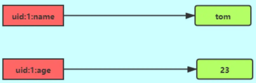
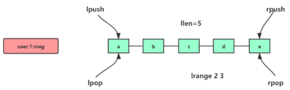
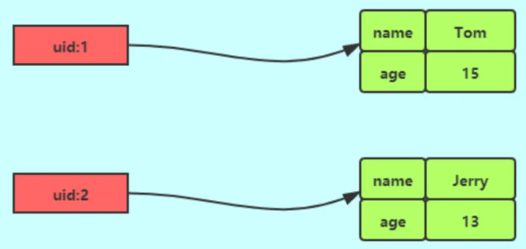
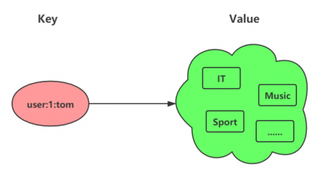
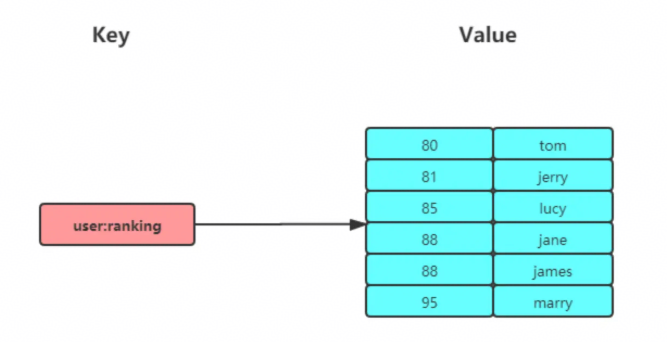
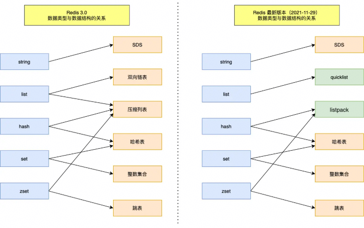
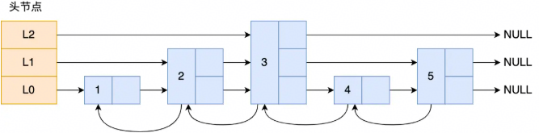
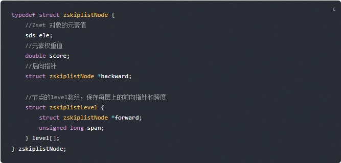
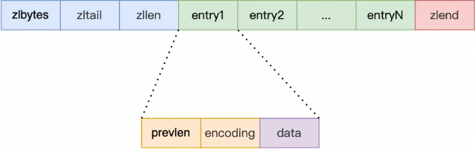
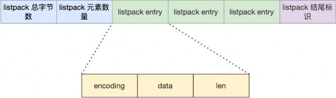

图解：[Redis 常见数据类型和应用场景 | 小林coding | Java面试学习](https://xiaolincoding.com/redis/data_struct/command.html)

面试题：[Redis面试题 | 小林coding | Java面试学习](https://xiaolincoding.com/interview/redis.html#数据结构)


## redis数据类型应用场景？

### String

key-value结构，key是唯一标识，value可以是字符串，也可以是数字，最大长度512M



- JSON对象：API响应体等
- 计数器：访问量、库存数量等
- 分布式锁：将【查询锁状态 + 加锁】合并，变成原子操作
- 分布式Session：多个服务共享用户Session，解决单机Session无法跨服务问题

```
# JSON对象
SET key '{"name":"gary"}'
DEL key
GET key

# 计数器
SET key 0
INCR key

# 分布式锁
SET key value NX EX 20
```


### List

字符串列表，底层结构是quicklist，按元素插入顺序排序，可以在头部和尾部添加元素



- 消息队列：需满足3个要求，顺序性、可靠性、处理重复消息
- 作为消息队列，如何保证消息顺序性：List按插入顺序排序
- 作为消息队列，如何保证消息可靠性：消费者执行BRPOPLPUSH（或BLMOVE）命令，从一个List读消息，再将消息插入到另一个备份List，重启后可以从备份List重新消费
- 作为消息队列，如何处理重复消息：redis自身不保证消息不重复，通常由生产者为每条消息设置唯一ID，消费者记录已处理过的ID，避免重复消费
- 作为消息队列，有什么缺陷：List类型的消息队列是点对点模式，不支持多个消费者消费同一条消息

```
RPUSH key value # 增加
LPOP/RPOP key # 删除
LRANGE key 0 2 # 查询[0, 2]区间元素
BLPOP key 1000 # 阻塞式读取，等待1000ms
```


### Hash

key-value集合，底层结构是压缩列表或hashtable，Redis7.0之后，数据量小时使用listpack，数据量大时使用hashtable



- 对象：Hash类型结构（key，field，value）和对象（id，属性，值）的结构相似
- 对象用String还是Hash：优先用String，对象某些频繁变化的属性可以考虑用Hash
- 购物车：以用户id为key，商品id为field，商品数量为value

```
HSET key field1 value1 field2 value2 # 增加
DEL uid:1 # 删除
HGETALL uid:1 # 查询
```


### Set

无序并唯一key-value集合



- 点赞：保证一个用户只能点一次赞
- 共同关注：通过2个集合的交集运算SINTER，获得共同关注
- 抽奖活动：保证一个用户不会中奖两次

```
SADD key value1 value2 # 增加元素
SREM key value1 value2 # 删除元素
SMEMBERS key # 查询集合元素
SINTER key1 key2 # 2个集合交集
```


### Zset

有序并唯一key-value集合，比Set多一个score字段，使用场景主要是【元素排序、按分数范围筛选】



- 排行榜：商品id作为member，销量作为score，可以查【销量前50~100名商品、某个商品销量排名、某个商品销量】
- 电话、姓名排序：对元素设置相同score，通过ZRANGEBYLEX命令，按字典序排序
- 带权重的队列：给重要元素设置更高的score

```
ZADD key score1 member1 score2 member2 # 增加元素
ZREM key member1 member2 # 删除元素
ZRANGE key 0 2 # 查询[0, 2]区间元素
ZRANGEBYLEX key - + # 查询所有元素，先按score排序，再按字典序排序
```


## redis数据类型的底层结构？

xxx



- xxx
- Zset：压缩列表（listpack）或跳表。元素少时，使用压缩列表（listpack）；元素多时，使用跳表


## Set和Zset的区别是什么？

区别主要有2点

- 有序性：Set无序；Zset按分数排序
- 使用场景：Set主要使用在去重场景（点赞、共同关注）；Zset主要使用在排序场景（排行榜）


## 介绍跳表？

跳表是多层有序链表，底层包含所有元素，上层链表是下层链表的子集（索引），增删查改元素的平均时间复杂度是O(logN)





- 查找元素过程：查找元素时，从最高层开始，尽可能向右移动，如果下一个节点大于目标值，就下降一层，重复这个过程，直到找到目标元素
- 设置节点层高方法：创建节点时，生成0~1之间的随机数，如果随机数小于0.25，层数增加一层，重复这个过程，直到随机数大于0.25，确认节点的层数


## redis为什么用跳表，而不是B+树

redis数据存放在内存中，使用跳表更快更简单，B+树为了压缩树高引入了页管理机制，在内存场景下没有优势

- 设计：B+树是为减少磁盘IO而生的，为了压缩树高引入了页管理机制，在内存场景下没有优势；而跳表在设计上不存在这种考虑，在内存场景下使用，更快更简单
- 实现复杂度：跳表本质上是多层链表，插入和删除节点主要是修改指针操作，实现简单；而B+树插入和删除节点可能需要页分裂、页合并、树平衡操作，实现复杂


## 介绍压缩列表（ziplist）？

压缩列表类似变长数组，根据数据类型和大小分配空间，目的是为了节省内存



- zlbytes：整个压缩列表占用字节数
- zltail：尾部节点距离起始地址的偏移量
- zllen：节点数
- zlend：压缩列表结束点
- prevlen：记录前一个节点的长度，目的是为了实现后序遍历
- encoding：记录当前节点类型和长度
- data：记录当前节点的数据
- 查找元素过程：首尾元素时间复杂度O(1)，其他元素时间复杂度O(N)
- 缺点：prevlen字段记录了前一个节点的长度，插入新元素时，存在连锁更新问题，只能用于节点数量少的场景（发生了连锁更新也能接受）

- 改进：quicklist（redis3.2）和listpack（redis5.0）


## 介绍listpack？

listpack类似变长数组，根据数据类型和大小分配空间，是redis5.0开始引入的数据结构，用来替代ziplist



- encoding：记录元素的编码类型
- data：记录当前元素数据
- len：记录当前元素长度（encoding + data）

- 优点：不再记录前一个节点的长度，插入新元素时，不存在连锁更新问题


## 哈希表怎么扩容？
