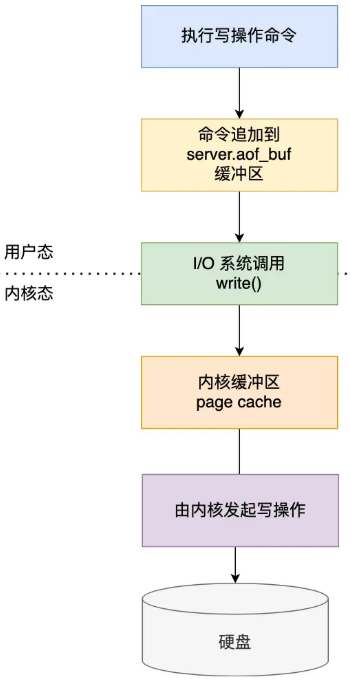

## 什么是Redis？

redis是一个基于内存的数据库，读写速度快，经常用来做缓存


## 什么是AOF日志（Append Only File）？

AOF日志记录了所有写操作命令，作用是实现数据的持久化，在redis宕机重启时，通过重新执行命令来恢复数据


- 写入时机，操作执行成功后，才记录AOF日志
- 写入时机好处，① 保证AOF日志中的命令都是正确的，避免了检查命令语法的开销；② 不阻塞当前操作
- 风险，① 操作执行成功后，AOF日志没来得及记录，造成数据丢失；② 主进程记录AOF日志，如果IO压力过大，可能阻塞下一个操作


## 写AOF日志过程？

redis执行写操作后，将命令先写入缓冲区，根据不同的写回策略，决定写入磁盘的时机



- redis执行写操作后，将命令写入aof_buf缓冲区
- 调用write()，将aof_buf缓冲区数据拷贝到page cache内核缓冲区
- 依据不同的回写策略，决定写入磁盘时机


## AOF写回策略？落盘策略？

redis写回策略由appendfsync参数控制，有三种策略，本质上是控制fsync()函数调用时机

- always，执行操作后，【主进程】将命令写入磁盘

- everysec（默认），执行操作后，【主进程】将命令写入缓冲区，【后台线程】每隔1秒将缓冲区数据写入磁盘

- no，执行操作后，【主进程】将命令写入缓冲区，由【操作系统】决定什么时候将缓冲区数据写入磁盘（30s左右）

- 查看配置（默认everysec）

  ```redis
  config get appendfsync
  ```


## 什么是重写AOF？

AOF重写，是将每个键值对用一条命令记录到新的AOF日志中，作用是实现AOF日志的压缩，防止AOF日志无限膨胀


## 重写AOF，使用子进程的好处？

重写AOF需要扫描所有键值对并写入，是重载操作，使用子进程有2个好处

- 不会阻塞主进程，重写需要扫描所有键值对，时间长，交给子进程完成不会阻塞主进程，主进程可以继续执行命令
- 子进程和父进程共享内存数据（以只读的方式共享），如果使用多线程，在修改共享内存数据时，需要通过加锁保证数据安全，影响性能


## 重写AOF，父子进程如何进行内存数据共享？

主进程通过fork创建子进程时，主进程的把【页表】复制给子进程，页表记录了虚拟地址和物理地址的映射，2个不同页表映射同一个物理地址，实现父子进程共享内存数据


## 重写AOF，什么情况下子进程会阻塞父进程？

2个阶段

- 创建子进程时，需要复制父进程页表给子进程，页表越大，阻塞时间越长
- 触发写时复制，父进程修改数据时，会触发写时复制，需要复制一份内存数据给子进程，修改的数据越多，需要复制的物理内存越大，阻塞时间越长


## 重写AOF过程中，修改了键值对，会发生什么？

xxx


## 什么是DRB快照（Redis Database Backup）？

DRB快照是全量数据的快照

- 执行save命令，在主线程生成DRB文件

- 执行bgsave命令，创建子线程生成DRB文件

- 优点，恢复速度快，恢复时，直接将DRB文件读进内存

- 缺点，生成DRB快照开销大，如果生产频率过高，性能开销大，如果生成频率过低，丢失数据多

- 查看配置（默认无）

  ```
  config get save
  ```


## 生成DRB快照时，数据能被修改吗？

可以，拥有写时复制（COW，Copy On Write）技术


## 什么是写时复制？

创建子进程后，子进程和父进程共享同一个内存页，当父进程尝试修改数据时，才复制一份新的内存页给子进程，作用是节省内存，降低主进程阻塞时间

- fork子进程时，复制父进程页表给子进程，父子进程共享同一个内存页

- 父进程尝试修改数据时，复制一份新内存页给子进程


## 写时复制的风险？

/

- 创建子进程时，需要复制父进程页表给子进程，页表越大，主进程阻塞时间越长
- 父进程修改数据时，会触发写时复制，需要复制一份内存数据给子进程，修改的数据越多，需要复制的物理内存越大，可能会造成内存翻倍，甚至内存溢出


## 什么是混合持久化（AOF和DRB合体）？

混合使用AOF和DRB，在重写AOF日志时，先将全量数据用DRB格式写入AOF文件，再将增量命令用AOF格式写入AOF文件，作用是恢复速度快，丢失数据少	


# 功能篇

## key如何设置过期时间？

执行命令

```
set key value px 1000 # 设置1000ms后过期
pexpire key 2000 # 设置2000ms后过期
ttl key # 数字代表过期剩余时间，-1代表不过期，-2代表已过期
```


## redis如何判定key已过期？

对key设置过期时间时，redis会把key放入过期字典，查询时，检查key在不在过期字典中，并且判断过期时间是不是在系统时间之前

- 过期字典数据结构，哈希表，key是指针，指向某个键对象，value是long long类型整数，记录key过期时间
- 过程1，对key设置过期时间时，redis把key放入过期字典，
- 过程2，查询key时，redis检查key在不在过期字典中，如果不在，返回键值，如果在，和系统时间比对，如果比系统时间小（在系统时间之前），判定key已过期


## 过期删除策略有哪些？

定时删除

- 做法，在设置key过期时间时，创建一个定时事件，当到达过期时间时，执行删除key操作
- 优点，保证key会被马上删除
- 缺点，过期key较多时，对CPU消耗大

惰性删除

- 做法，不主动删除过期key，每次数据库访问key时，检查key是否过期，如果过期则删除
- 优点，对CPU消耗小
- 缺点，如果key一直不被访问，key无法被删除，造成内存浪费

定期删除

- 做法，定期随机从数据库取出一定数量的key进行检查，并删除过期key
- 优点，对CPU消耗可控，和惰性删除相比，能删除较多的过期key
- 缺点，难以确定删除操作的频率，如果太频繁，和定时删除一样，对CPU消耗大；如果频率太小，和惰性删除一样，造成内存浪费

