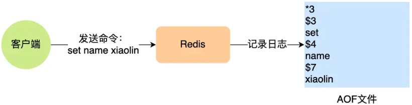
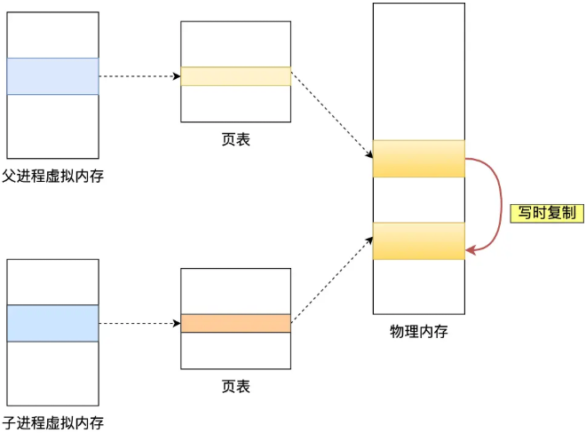

图解：[AOF 持久化是怎么实现的？ | 小林coding | Java面试学习](https://xiaolincoding.com/redis/storage/aof.html#aof-日志)

面试题：[Redis面试题 | 小林coding | Java面试学习](https://xiaolincoding.com/interview/redis.html#数据结构)


## 什么是AOF日志（Append Only File）？

AOF日志记录了所有修改数据的命令，作用是在redis宕机重启时，可以通过重新执行命令来恢复数据，从而实现数据持久化



- 写入时机：命令执行成功后，记录AOF日志
- 写入时机好处：① 保证AOF日志中的命令都是正确的，避免了检查命令语法的开销；② 不阻塞当前操作
- 风险：① 命令执行成功后，AOF日志可能还没记录，此时redis宕机，数据丢失；② AOF日志由主线程记录，如果IO压力过大，可能阻塞下一个命令


## 写AOF日志过程？

redis执行命令后，将命令先写入缓冲区，根据不同的写回策略，决定写入磁盘的时机


- redis执行命令后，将命令写入aof_buf缓冲区
- 调用write()，将aof_buf缓冲区数据拷贝到page cache内核缓冲区
- 根据不同的回写策略，决定写入磁盘时机


## AOF写回策略？落盘策略？

redis写回策略由appendfsync参数控制，有三种策略，本质上是控制fsync()函数调用时机

- always，执行操作后，【主线程】将命令写入磁盘

- everysec（默认），执行操作后，【主线程】将命令写入缓冲区，【后台线程】每隔1秒将缓冲区数据写入磁盘

- no，执行操作后，【主线程】将命令写入缓冲区，由【操作系统】决定什么时候将缓冲区数据写入磁盘（30s左右）

- 查看配置（默认everysec）

  ```redis
  config get appendfsync
  ```


## 什么是AOF重写？

AOF重写，（由后台子进程）将每个键值对用一条命令记录到新的AOF日志中，作用是压缩AOF日志，防止日志无限膨胀


## AOF重写，使用后台子进程的好处？

AOF重写，需要读取所有键值对并写入，是重载操作，使用后台子进程有2个好处

- 不会阻塞主进程：重写需要读取所有键值对，时间长，交给子进程执行，不会阻塞主进程
- 子进程可以共享父进程内存数据（以只读的方式共享）
- 为什么不使用多线程：如果使用多线程，在修改共享内存数据时，需要通过加锁保证数据安全，影响性能


## AOF重写，父子进程如何进行内存数据共享？

父进程（通过fork）创建子进程时，父进程会把【页表】复制给子进程，这样子进程就拥有了和父进程一样的页表，页表映射同一个物理地址，实现了父进程把内存数据共享给子进程

- 什么是页表：页表记录了虚拟地址和物理地址的映射




## 什么是写时复制？写时复制风险？

子进程共享父进程内存数据，当父进程尝试修改数据的时候，会触发写时复制，父进程会复制一份新的内存数据给子进程

- 作用：① 在只读场景下，多个进程共享一份内存，节约空间；② 只复制需要修改的数据，减少主进程阻塞时间

- 风险1：创建子进程时，父进程会把页表复制给子进程，页表越大，主进程阻塞时间越长

- 风险2：触发写时复制时，父进程会复制一份新的内存数据给子进程，修改的数据越多，需要复制的数据越多，主进程阻塞时间越长


## AOF重写过程中，修改了键值对，会发生什么？

xxx


## 什么是DRB快照（Redis Database Backup）？

DRB快照是全量数据的快照

- 命令：执行save命令，在主线程生成DRB文件；执行bgsave命令，创建子线程生成DRB文件

- 优点：恢复速度快，恢复时，直接将DRB文件读进内存

- 缺点：生成DRB快照开销大，如果生成频率过高，性能开销大，如果生成频率过低，丢失数据多

- 查看配置（默认不生成）

  ```
  config get save
  ```

