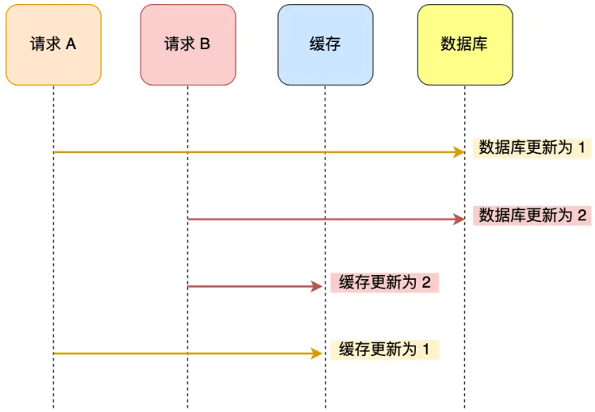
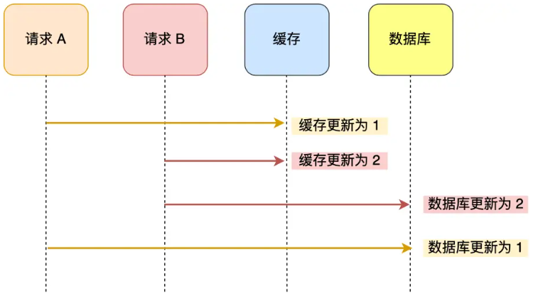
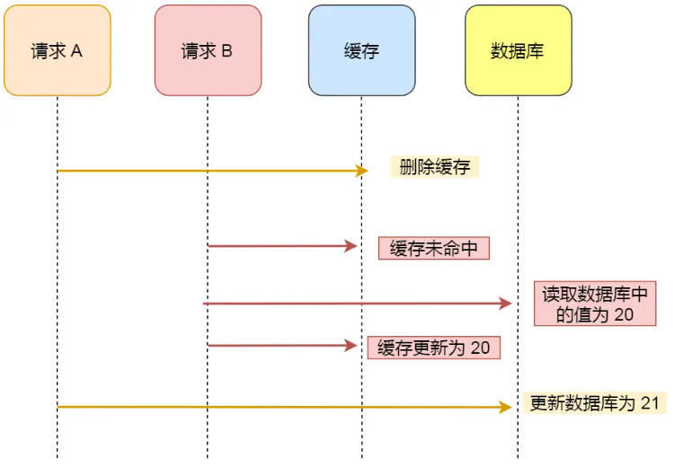
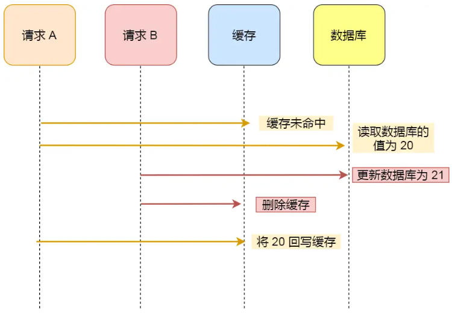

图解：[数据库和缓存如何保证一致性？ | 小林coding | Java面试学习](https://xiaolincoding.com/redis/architecture/mysql_redis_consistency.html)

## 先写数据库，再写缓存？

2个请求同时更新一条数据，请求A写数据库后，出现网络延迟，请求B写数据库和缓存，请求A写缓存。数据库是B的数据，缓存是A的数据，数据库和缓存数据不一致

- 缺点：在写并发场景下，不能保证数据最终一致性；写操作开销大，生产环境几乎不用【写缓存】策略

## 先写缓存，再写数据库？

2个请求同时更新一条数据，请求A写缓存后，出现网络延迟，请求B写缓存和数据库，请求A写数据库。数据库是A的数据，缓存是B的数据，数据库和缓存数据不一致

- 缺点：在写并发场景下，不能保证数据最终一致性；写操作开销大，生产环境几乎不用【写缓存】策略

## 先删缓存，再写数据库？

请求A删完缓存后，请求B无法命中缓存，读取旧数据写入缓存，请求A再更新数据库，数据库是新数据，缓存是旧数据

- 优点：无
- 缺点：在读写并发场景下，不能保证数据最终一致性

- 延迟双删：写完数据库，等一会，再删一次缓存。作用是尽可能保证数据一致性
- 延迟双删为什么要延迟：延迟是为了让其他线程有足够时间【读数据库并回写缓存】，延迟时间通常设置为【读数据库耗时 + 500ms】

## 先写数据库，再删缓存？

请求B读缓存未命中，读取数据库数据，还没来得及回写缓存；请求A更新数据库数据，并删除缓存数据；请求B将旧数据回写缓存，造成数据不一致（发生概率较低）

- 优点：实现简单；在读写并发场景下，大概率能保证数据最终一致性（缓存过期可能出现数据不一致）
- 缺点：写完数据库，缓存没被删除时，会查到脏数据（时间短）；删除缓存失败时，数据不一致

## 删除缓存和修改缓存区别？

删除缓存比修改缓存，操作简单，不需要考虑并发写问题

- 时间：修改缓存可能涉及复杂计算（将数据库值转换为缓存）
- 惰性：删除缓存是简单操作，符合惰性加载思想
- 并发：如果多个线程同时修改缓存，需要考虑并发写问题，删除没有这个问题

## 消息队列重试删除？

如果删除redis数据失败，发送消息到消息队列（异步），服务收到消息后，重新尝试删除redis数据

## canal重试删除？

canal监听binlog，当MYSQL数据发生修改时，canal通过消息队列通知java服务（canal客户端），java服务删除redis数据，如果删除redis数据失败，重新尝试删除redis数据

- 优点：业务解耦

- 缺点：组件多，部署复杂

## 方案如何选择？

看场景，需要数据强一致，还是需要高性能

- 需要数据强一致的场景（金融），使用锁，需要牺牲性能
- 需要高性能的场景（高并发），使用双删+消息队列，只能尽量保证强一致
- 读多写少（实际工作），使用先写数据库，再删缓存（Cache Aside旁路缓存）策略，如果删除失败，等redis数据过期，或后台线程定期刷新redis数据
