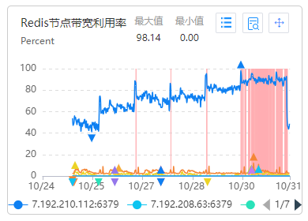

## 又大又热key，导致redis带宽告警

### 现象

- 告警：redis单分片带宽使用率超90%
- 监控数据：单分片告警，其他分片正常，故障分片每秒并发数逐渐升高至1w+

.png)

### 定位过程

#### 大key&热key分析

进行热key分析，发现故障分片上，有多个频度255的热key，其中最大的key有144KB，属于大key

.png)

#### 代码定位

代码全局搜索热key关键字，找到故障原因

.png)

- 系统参数管理服务sysparam，把2000多个参数放进map里，为了支持分布式访问，把整个map以字符串的格式存入redis

- 当需要读取某个参数时，需要从redis中完整取出大key，每次会占用144KB带宽，一个分片带宽上限大概是900MB
- 一次API接口请求，会多次读取参数（局点endpoint和拼接url），那段时间API调用量上升，导致大key读取更加频繁，最终打满redis分片带宽

#### 尝试规避

代码上线需要等周六晚变更，周六前只能找办法规避

- 修改redis连接池参数：扩大了一倍maxActive和maxIdle，尝试提高redis并发，效果不明显
- 带宽扩容：提单给redis客服，对带宽进行临时扩容，但扩容持续时间只有7天，一个redis实例最多可以申请3次（最终用此方法规避）
- 高频接口限流：通过nginx日志查询高频接口，发现两个鉴权接口，每秒钟调用几百次，使用API网关对接口限流（减缓病情）

#### 变更后仍偶现问题（重新加载参数表为非原子操作 + 缓存穿透）

代码上线后，调度api调用还是会偶现失败，报错信息【后台未配置内部鉴权参数，请联系云道管理员】

.png)

走读代码，推测可能是有概率获取键值失败，重新审视变更代码

.png)

.png)

如果获取不到键值，缓存服务判断这个键值可能是新增的，尝试重新加载参数表（目的是防止脏数据遗留在redis中），做法是先将redis键值删除再重新赋值del+set，但del+set不是原子操作，会导致2个问题

- del+set不是原子操作：del+set不是原子操作，在del和set的间隙读取键值会失败

- 缓存穿透：在高并发情况下，可能有请求一直访问不存在的键值，导致缓存服务持续重新加载参数表，频繁访问MYSQL

### 措施

- 带宽扩容（临时规避）
- 高频接口限流（减轻病情）
- 拆分大key：map存储在redis中的格式由string改为hash，读取key时间和空间复杂度从O(N)下降到O(1)，读取key时间从20ms下降到5ms（带宽问题根治）
- 修改加载参数表时机：运行时不再自动检查是否新增键值，自动执行重新加载参数表，重新加载参数表操作改为只能在运维端手动执行，只set不del（缓存穿透问题根治）
- 遗留问题：由于重新加载参数表改为只set不del，hash数据只增不减

## 缓存穿透，导致数据库CPU打满

