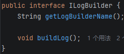
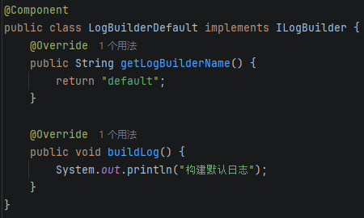
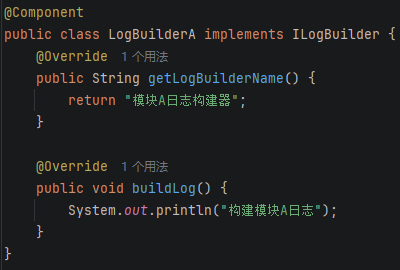
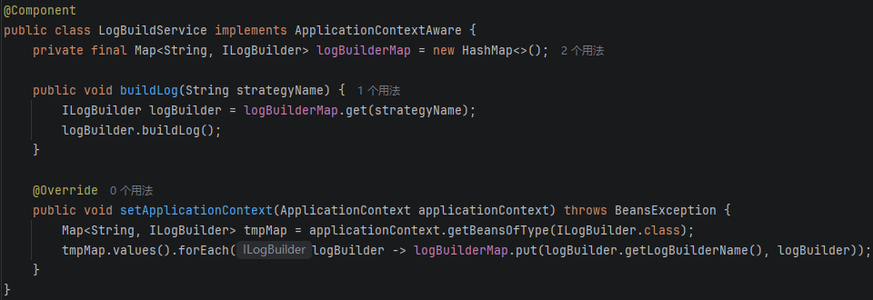

小林公众号：[面试官：你项目用过哪些设计模式？](https://mp.weixin.qq.com/s/sHuvllHyB_xp62lSeB28mw)

## 思想

将一组可以互换的算法，封装成独立的类，使用方在运行时选择需要的算法

- 优点：避免大量条件判断；新增类型，不需要修改原代码（新增一个模块，不需要修改公共包代码，只需要加一个实现类    ）

## 应用场景

不同类型数据，使用不同方法

- 痛点场景：通过if-else判断当前模块，执行对应模块打印日志方法
  - 开闭原则（扩展开放，修改关闭）：新增某段逻辑，需要修改原代码
  - 单一原则（一个类只有一个发生变化原因）：新增一个新模块，需要修改原代码
- 常用场景：日志打印、文件处理、角色权限校验、入参校验

- 真实场景：打印不同模块的操作日志、deploy在不同操作系统上部署java服务

## 代码实现

代码实现3个要点

- 定义策略模版：1个接口类或者抽象类，作为模版，至少包含2个方法（获取策略类型，执行策略）

- 实现策略模版：不同策略类实现策略模版

- 使用策略模式：借助spring生命周期，使用ApplicationContextAware接口，把策略初始化到map中，对外提供执行策略方法

### 定义策略模版

### 实现策略模版

### 使用策略模式

