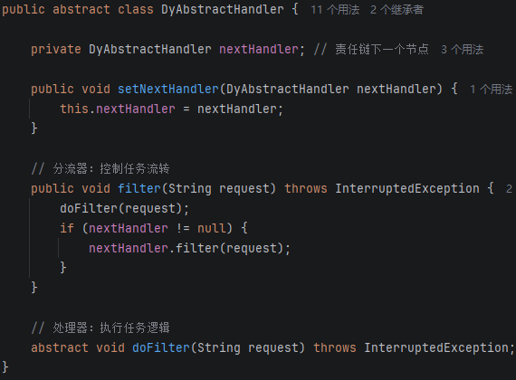
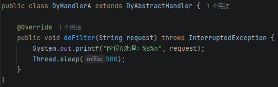
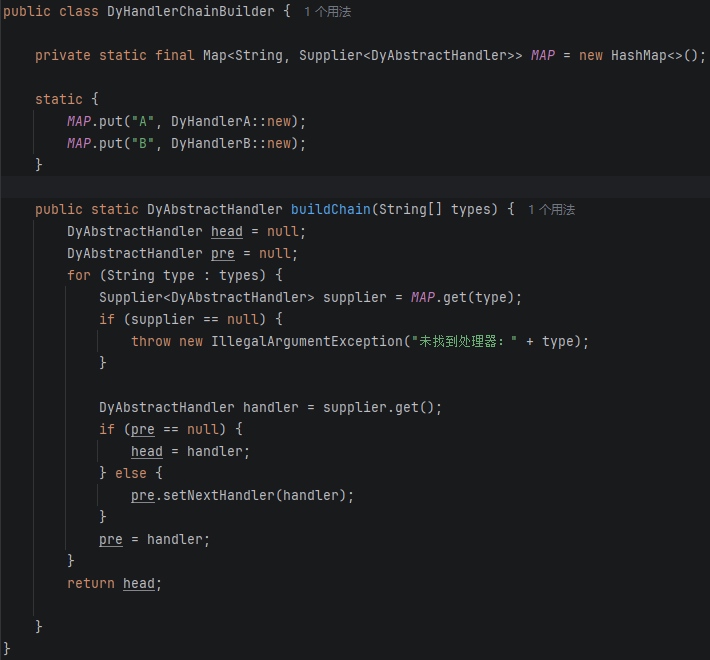
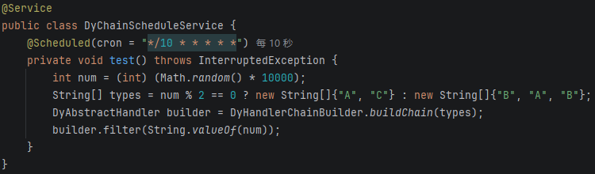

小林公众号：[面试官：你项目用过哪些设计模式？](https://mp.weixin.qq.com/s/sHuvllHyB_xp62lSeB28mw)

## 思想

将多个处理器串联起来，请求沿着链路传递（击鼓传花）

- 优点：降低耦合，每个处理器只需要关心自己的处理逻辑，和下一跳去哪；动态编排，可以根据不同场景，动态编排处理器链路

## 应用场景

多个处理器，根据不同场景组合不同顺序

- 痛点场景：API参数校验时，需要进行多重校验，如果校验失败，使用抛出异常方式，违反阿里开发手册【使用异常来控制业务逻辑流程】，因为异常处理效率比条件判断慢很多；使用布尔值返回，需要进行多次条件校验，执行顺序固定
- 常用场景：API参数校验、电子流审批、多级缓存
- 真实场景：deploy部署java服务多个步骤编排、deploy工具箱步骤编排、调度编排机器状态流转

## 代码实现

代码实现3个要点

- 定义处理器模版： 一个抽象类作为模版，包含一个指向下一个处理器的指针、一个控制流转方法filter、一个处理逻辑方法dofilter（子类实现）

- 实现处理器模版：不同处理器实现处理器模版，只需实现处理逻辑方法dofilter

- 编排处理器链路：根据不同处理器链路，修改每个处理器指针指向，实现动态编排

### 定义处理器模版

### 实现处理器模版

### 编排处理器链路

